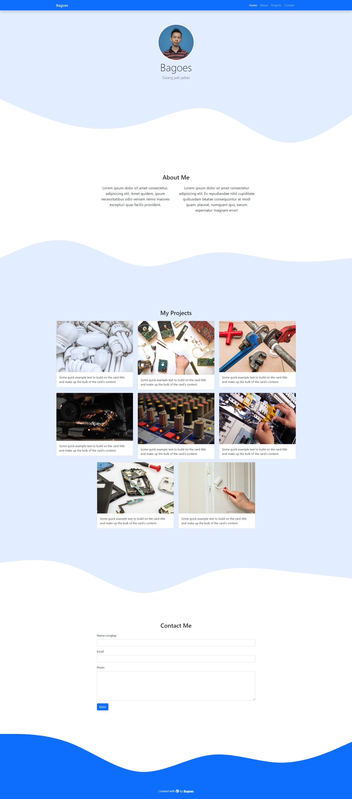

Latihan membuat halaman web portfolio yang ke-3 menggunakan Bootstrap 5.  

Pratinjau :

Hasilnya bisa dilihat dari link ini :   
👀 [Portfolio 3](https://bagoes.github.io/portfolio-3/ "preview"){:target="_blank"}  

Referensi:

Tutorial video dari tautan berikut ini 🚀 [NGOBAR#27](https://youtu.be/LkR-9Z1sle8 "Web Programming UNPAS"){:target="_blank"}